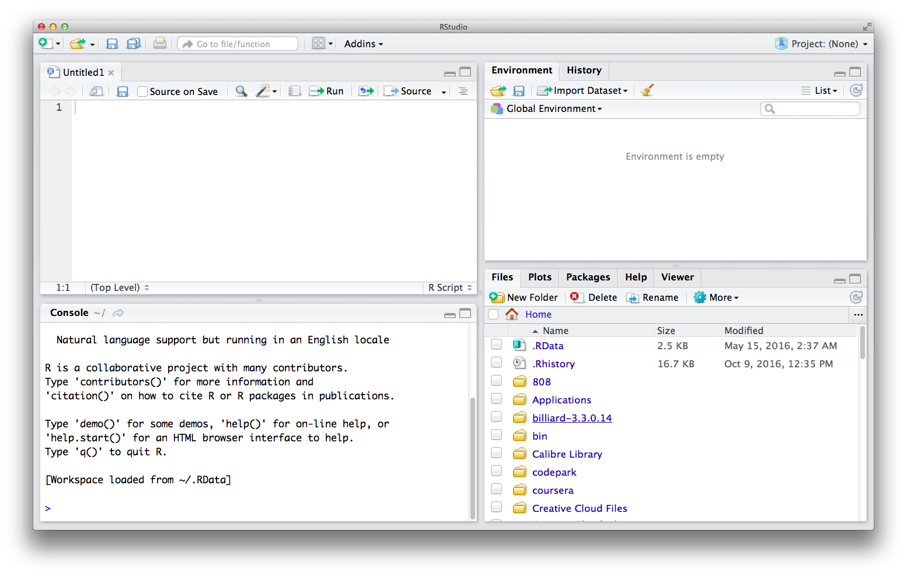
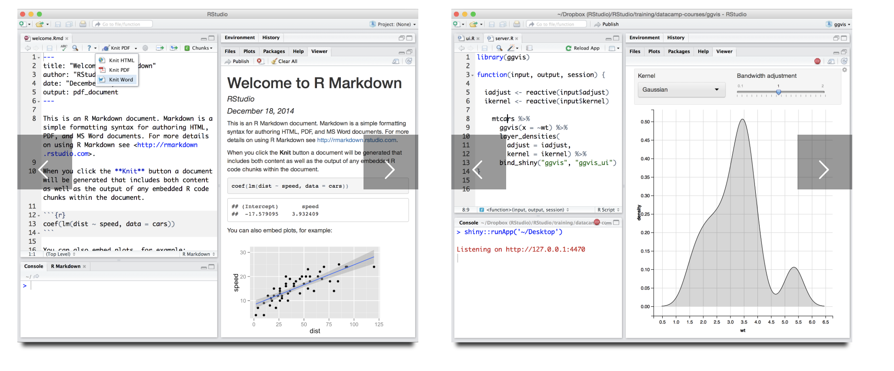
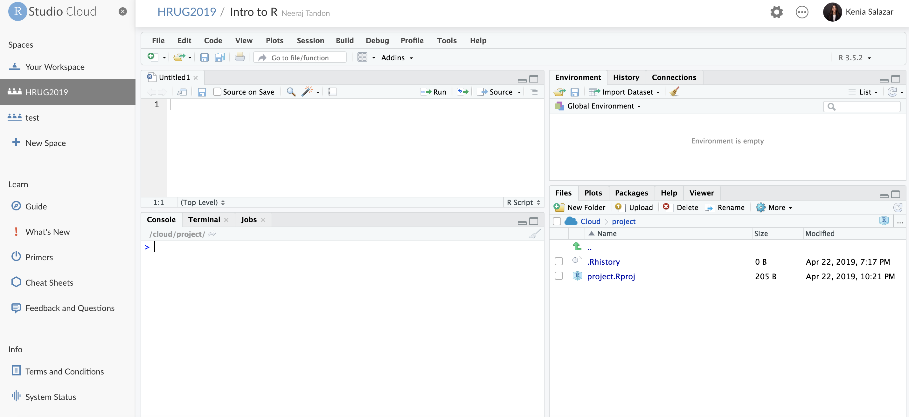

# Welcome to intro to R!

##  1.1 - Why to use R?

R is a programming language designed specifically for statistics by statisticians. (This is probably the biggest benefit and the worst thing about R)
  - Open source and with a huge community support.
  - Very popular among statisticians, researchers and the academia.
  - Statistical models can be written with few lines of code.
  - Exploratory work can be easy for beginners.
  - It doesn't require the installation of packages for basic data analysis.
  - It has great graphical capabilities _ggplot_.

## 1.2 - Some limitations of R

  - R requires data to be loaded into memory
  For projects where exceptionally large data needs to be analyzed or processed very quickly, we will want to consider using tools that help us work around the memory limitations.

  -  R is limited in producing highly-customized and interactive reporting visualizations
  While R is able to produce interactive graphics, maps, and dashboards, a lot of the more expressive and customized interactive data presentations will require knowledge of JavaScript.

  - R is not as expressive for general tasks such as scraping and crawling
  R packages like tidyr and dplyr are making R more expressive; the result is R is becoming a strong competitor in more general tasks like data-mining, data-wrangling, and scraping and crawling for data.

  - Lacks flexibility for production use, especially when the data analysis tasks need to be integrated with web applications.

Overall, R is a top choice for data exploration, modeling, analysis, and static graphics.

## 1.3 - What is the scope of this workshop?

This workshop will cover steps and code that can be readily adapted for small to moderate sized datasets.

Specifically, we will be:
  - Loading in data
  - Exploring it
  - Tidying it
    - Cleaning it
    - Visualizing it
    - Modeling it
  - Calculating descriptive statistics
  - Making a report

We will also cover how to get help and how to learn more about using R. Additionally, we’ve pulled together different resources for things we aren’t covering into our appendix.

##  1.4 - Who to code and execute R - What is RStudio?
Today, we will be working with R in RStudio (an integrated development environment (IDE)).  While there are other programs we can use to write R, RStudio has become the standard environment for working with R.

**Some of RStudio best features are:**

  • The main components are all nicely integrated into a four-panel layout, this includes:
    - A console for interactive R sessions.
    - An editor that supports direct code execution.
    - An environment and history viewer
    - Tools for plotting, and files and workspace management.
  • Setting up different projects is a snap, and switching between them is even easier.

  • Great capabilities to create reports and visualize data.

  

  • RStudio runs on the desktop for the three main operating systems (Windows, Mac, and Linux) or in a browser connected to RStudio Server for remote access.  

If you don't wish to install RStudio in your computer or if you don't have access to it due to IT policies in your office, no worries, use RStudio Cloud. That's what we'll be using today!!!

  

After logged into your account, RStudio cloud will look very similar to the desktop version. Let's start diving in some data...
